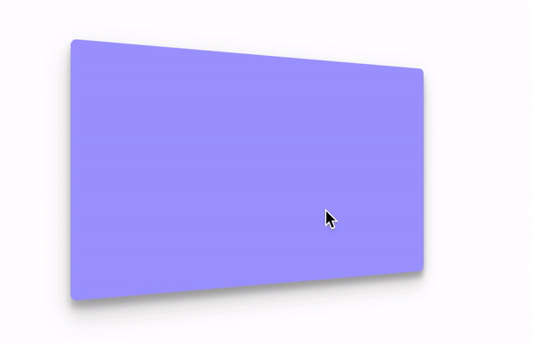
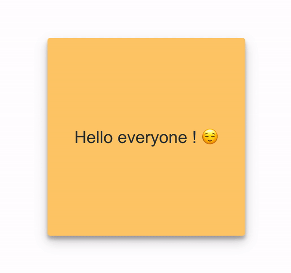
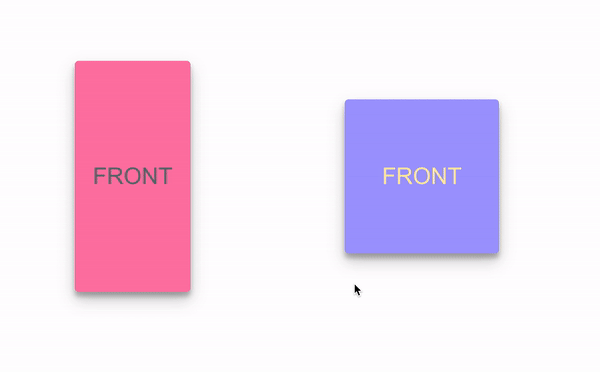
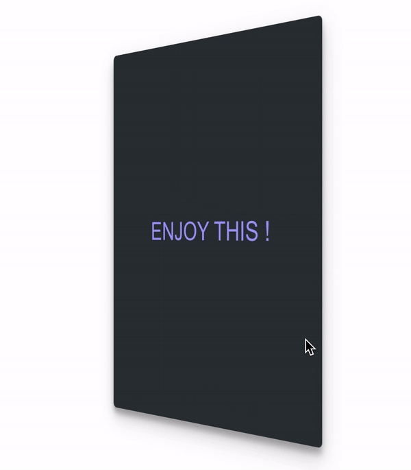
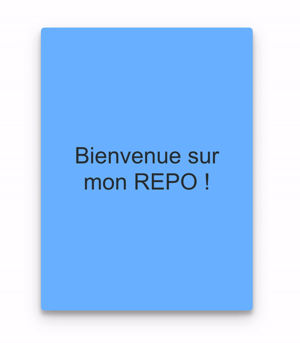
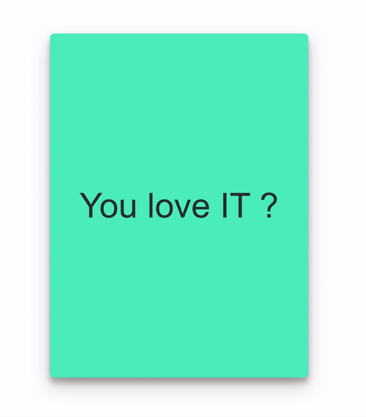

# FCComponent (Flip card component)


<div>
  
  
  
</div>

- [Installation](#installation)
- [Usage](#usage)
- [Documentation](#documentation)
- [Color guide](#color)
- [Exemple](#exemple)
- [Contribute](#contribute)
- [License](#license)

## Installation 

```
npm i fc-card-component
```

## Usage

```jsx
import React from 'react';
import FlipCard from 'fc-card-component';

function App() {
  return <div>
    <FlipCard />
  </div>
}
```

## Documentation

| Property | Type | Value | Description |
| :---: | --- | --- | --- |
| colorFront | `String` | ref. Color guide | Background color for front card |
| colorBack | `String` | ref. Color guide | Background color for back card | 
| textColorFront | `String` | ref. Color guide | Text color for front card | 
| textColorBack | `String` | ref. Color guide | Text color for back card | 
| textFront | `String` | Any string | Text will display on front card | 
| textBack | `String` | Any String | Text will display on back card | 
| height | `Number` | [1...∞] | Height of component | 
| width | `Number` | [1...∞] | Width of component | 
| innerPadding | `Number` | [1...∞] | Padding of component | 
| fontSize | `Number` | [1...∞] | Size of font, attribute for textFront and textBack | 
| rotationAxis | `String` | `"x"` or `"y"` | The axis of rotation on which the card will rotate.  | 

## Color

## Exemple 



```jsx
import FlipCard from "fc-card-component";

function App() {
  return (
    <div className="App">
      <FlipCard
        height={400}
        width={300}
        rotationAxis="x"
        colorFront="dark-black"
        textColorFront="light-orange"
        textColorBack="purple"
        textFront="Voici un exemple de Custom Flip Card"
        textBack="ENJOY THIS !"
        innerPadding={20}
        fontSize={27}
      />
    </div>
  );
}

export default App;
```
<details><summary>CLICK HERE - For another exemples</summary>
<p>

### Exemple 2



```jsx
import FlipCard from "fc-card-component";

function App() {
  return (
    <div className="App">
      <FlipCard
        height={400}
        width={300}
        rotationAxis="x"
        colorFront="light-blue"
        textColorFront="dark-black"
        textColorBack="purple"
        textFront="Bienvenue sur mon REPO !"
        textBack="ENJOY THIS !"
        innerPadding={30}
        fontSize={32}
      />
    </div>
  );
}

export default App;
```

### Exemple 3



```jsx
import FlipCard from "fc-card-component";

function App() {
  return (
    <div className="App">
      <FlipCard
        height={400}
        width={300}
        rotationAxis="y"
        colorFront="light-green"
        colorBack="dark-green"
        textColorFront="dark-black"
        textColorBack="dark-black"
        textFront="You love IT ?"
        textBack="Star my repo to tell me ❤️"
        innerPadding={30}
        fontSize={40}
      />
    </div>
  );
}

export default App;
```

</p>
</details>

## Contribute

Show your ❤️ and support by giving a ⭐. Any suggestions are welcome!

## License

Licensed under MIT
